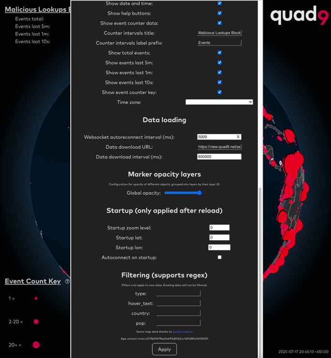

<p align="center">
 
</p>

# Globe of Wonder
The Globe Of Wonder (GoW) is a WebGL-based spinning or static globe that shows events ingested from a websocket (or a file) with lat/lon data, placing visible events on a customizable globe in a number of animated or static formats that aid in the rapid understanding of events as they are distributed worldwide. Events can be filtered on the client, and visualization can be extended with some criteria (labels, sizes, durations) via JSON tags. It was written by Quad9, and is the basis of the QED (Quad9 Event Dashboard) that shows the realtime DNS blocking event stream on the Quad9 network, as well as a number of other near-realtime data behaviors as they are observed globally.

## Display Elements
The GoW supports several object types which can be positioned on the map:
* **Markers:** Markers can be permanent, or can have a "time to live", and can be displayed as a result of websocket objects, or they can be ingested on startup from a JSON file specified by a URL (with a reload interval.) The types of markers are: "Explosions" (spheres that appear and gradually disappear, with varying scales) were the first markers created, followed by circles, pointers, bars (rising away from the planet surface,) and user-specified PNG downloads. Markers can have labels, hover labels, and click-through URLs specified.
* **Heatmap:** Based on the number of events placed at nearby lat/lon pairs, a heatmap can be generated on the surface of the globe
* **Analysis mode:** Instead of static bars with fixed heights as markers provide, an analysis mode can be enabled which adds subsequent events in a user-specifiable radius and creates bars that raise away from the surface of the globe with varying heights which may also shrink with customizable decay windows.
* **Arcs** If an event has a pair of lat/lon points, arcs between the two points can be displayed with a variety of animations, line formats/colors, and labels.

Each event can have a counter which indicates a higher weight for that JSON object than a single event. This allows aggregation and saves transmission bandwidth.

There are two special display elements which are keys or counters. The event counters are for counting the number of events displayed on the map over a selectable set of time periods, and showing those counters in the upper left of the window - 10 seconds, 1 minute, 5 minutes, and total. These take into consideration the "counter" and "counter_include" fields. The other key is specifically for the "explosion" marker type, which allows scaling of the size of the explosion based on the "counter" field associated with the event. This allows larger events to have a larger sphere drawn on the map, and the event count key displays the relative size of the sphere as a key in the lower left corner of the window so viewers can understand what the larger spheres indicate. Both key and counters may be turned off entirely, and have help windows.

The graphic in the upper right corner of the window can be switched out, but is required in some form as it is also the method by which the settings page is reached.

Timestamp and websocket status can be displayed in the lower right corner of the page, with customizable timezone.

## Views and behaviors
There are several ways to modify the view of the globe:
   - Light mode (blue water/forest cover)
   - Dark mode (dark water/dark landmass/populated area lights)

The globe can be auto-rotating, or can be static. Atmospheric haze can be enabled or disabled. Terminator boundary and stars would be welcome patches as long as they were selectable.

National political boundaries can be turned on or off, and also can be specified on a per-nation basis at the second-level (province/state/etc.) These are fairly heavy to render, and should be used with temperance.

Once a JSON websocket stream is successfully ingested, any fields in the JSON will be presented in the settings menu at the bottom of the settings view, and then may be used to define regular expression filters on those fields.  For instance, if you had a JSON object of "country" which contained two-digit ISO3166 country codes, then it would be possible to filter on just Swiss and Japanese data by entering "ch|jp" in the "country" filter.  This set of filters is dynamic, so in order for a filter to show up it must have been seen in a websocket-based message prior to opening the settings window. However, if you specify a filter in the URL on initial call of the globe page, it will be accepted even before that session has seen the named field. Fields that are not mapped to names that have special meaning as interpreted by the GOW have no effect on the map; they are simply used as filter criteria.

There are values that can be added to the URL for auto-connection and first-view behaviors: websocketUsername (string of username), websocketPassword (string of password, unencrypted), and autoconnect (true/false), startupZoom (how far to zoom the map) and startupLat/startupLon.

The "explosion" event type has 20km randomization of placement, in order to effectively show activity in areas which have many events that happen with the same lat/lon coordinates. 

There is a slight randomized delay built in to events being placed on the map to "smooth" events across time. This was due to websocket buffers emptying quickly, which caused bursty behaviors and unpleasing rendering. This probably should be made into an optional smoothing mechanism but is currently hard-coded.

Events with 0,0 as lat/lon are not shown.

If the websocket disconnects, there will be a 5 second delay, and then a re-connection will be attempted.

## URL Access

Any changes made in the settings window (click on the upper right corner icon to get the settings window) will be made available immediately in the current URL if they are set to non-default values. This allows cut/paste or bookmarking of custom views and data sets.

## Tooling

Uses three.js and three-globe to render out Earth with markers on positions received from websocket.

By default it connects to `wss://view.quad9.net/websocket/5000`, but it can be controlled with `VITE_WEBSOCKET_URL` environment variable when building.

Install dependencies with `npm install`

To build: `npm run build`
To run development server: `npm run dev`
To run the linter, run: `npm run lint`
To also fix the issues which can be fixed automatically, run: `npm run lint:fix`

## Example Screenshots

<p align="center">
 
 
 
 
   
</p>

## Websocket data

Data that is expected from websocket (or file downloads) is defined in [service/data.ts (ServiceData)](./src/service/data.ts#L132).

| Key                                | Default value                                     | Description                                                                                                                                          |
|------------------------------------|---------------------------------------------------|------------------------------------------------------------------------------------------------------------------------------------------------------|
| lat                                | - (required)                                      | Latitude of the event                                                                                                                                |
| lon                                | - (required)                                      | Longitude of the event                                                                                                                               |
| type                               | explosion                                         | Type of the event (explosion, circle, pointer, bar, downloaded, arc)                                                                                 |
| ttl                                | 15000 (explosion), 5000 (arc), Infinity otherwise | How long the item should be visible on the map                                                                                                       |
| fade_duration                      | -                                                 | Fade period at the end of object lifetime                                                                                                            |
| opacity                            | 100                                               | Object opacity (0-100). This can be further modified with global opacity slider and per layer opacity sliders                                        |
| layer_id                           | -                                                 | Assigns this object to a specific layer (number id). All layers can be controlled in settings, by subtracting opacity from all objects in the layer  |
| layer_name                         | -                                                 | If defined, sets a name for this layer in the settings dialog.                                                                                       |
| ignore_zoom                        | false                                             | When set to true object will stay roughly the same size on the screen, regardless of the zoom level                                                  |
| always_faces_viewer                | false                                             | When set to true object will automatically rotate to always face the viewer. This will rotate the whole object, including the label if present.      |
| counter                            | 1                                                 | Can be used to put weight on the event. Higher counter produces larger "explosions". Can be set to 0 to not increment counter but still show on map. |
| counter_include                    | true                                              | Can be used to decide whether to include the event in event counter in top left                                                                      |
| display_text                       | -                                                 | Text to display over event.                                                                                                                          |
| display_text_interval              | 5000                                              | Time in milliseconds for the text to be visible.                                                                                                     |
| display_text_font                  | Courier                                           | Font to use for the text displayed over the event                                                                                                    |
| display_text_font_size             | 100                                               | Font size in pixels                                                                                                                                  |
| display_text_font_style            | -                                                 | Can be defined to make the displayed text bold or italic (or combination, e.g. "Bold Italic")                                                        |
| display_text_color                 | white                                             | Color to use for the text.                                                                                                                           |
| display_text_outline_color         | black                                             | Color to use for the text outline.                                                                                                                   |
| display_text_always_faces_viewer   | false                                             | If set to true, the label will automatically rotate to always face the viewer.                                                                       |
| display_text_hover_only            | false                                             | If set to true, the label will only be displayed when hovered over with the mouse.                                                                   |
| link_url                           | -                                                 | Link to open when an event is clicked, or when the hover window is clicked if available.                                                             |
| new_window                         | true                                              | Whether to open the link in a new window or current window                                                                                           |
| hover_text                         | -                                                 | Text to display in a dialog when hovering over an object (or clicking if the object also has `display_text` defined).                                |
| enabledBoundariesLayers            | -                                                 | Comma-separated list (or single) two-digit national code; will show internal state/province/canton/etc. boundaries                                   |
| explosion_initial_color            | #ff2000 (dark mode) or #5edc20 (light mode)       | Initial color of the "explosion" event.                                                                                                              |
| explosion_initial_radius_interval  | 1350                                              | Duration in milliseconds until "explosion" settles into stable size.                                                                                 |
| explosion_initial_radius_size      | 63.71                                             | Radius of "explosion" in kilometers at its highest point when counter is 1.                                                                          |
| explosion_fallback_color           | #dc205e (dark mode) or #328708 (light mode)       | Color for the "explosion" event to settle into.                                                                                                      |
| explosion_fallback_radius_interval | 13650                                             | Duration in milliseconds for "explosion" to stay visible after settling into stable size.                                                            |
| explosion_fallback_radius_size     | 63.71                                             | Radius of "explosion" in kilometers when settled.                                                                                                    |
| circle_radius                      | 63.71                                             | Radius of circle in kilometers.                                                                                                                      |
| circle_color                       | green                                             | Color of the circle.                                                                                                                                 |
| circle_outline_color               | black                                             | Color of the circle outline. By default not drawn if neither this nor circle_outline_thickness are defined                                           |
| circle_outline_thickness           | 1                                                 | Thickness of the circle outline. Relative to the radius of the circle.                                                                               |
| pointer_background_color           | #dc205e                                           | Color of the pointer background.                                                                                                                     |
| pointer_border_color               | #ba103b                                           | Color of the pointer border (outline).                                                                                                               |
| pointer_glyph_color                | #ba103b                                           | Color of the pointer glyph (circle in the middle).                                                                                                   |
| pointer_scale                      | 1                                                 | Relative scale of the pointer, relative to its original size (~130 kilometers radius).                                                               |
| bar_height                         | - (required - bar type only)                      | Height of the bar in kilometers.                                                                                                                     |
| bar_diameter                       | 63.71                                             | Diameter of the bar in kilometers.                                                                                                                   |
| bar_bottom_color                   | green                                             | Color of the bar at the bottom. Bar is drawn as a gradient.                                                                                          |
| bar_top_color                      | green                                             | Color of the bar at the top. Bar is drawn as a gradient.                                                                                             |
| downloaded_object_url              | - (required - downloaded type only)               | URL to an image to lay over the globe. Transparency is supported.                                                                                    |
| downloaded_object_scale            | 1                                                 | Relative scale of the image.                                                                                                                         |
| point2_lat                         | - (required - arc type only)                      | Longitude of the arc end point. lat/lon are used as the start point.                                                                                 |
| point2_lon                         | - (required - arc type only)                      | Longitude of the arc end point. lat/lon are used as the start point.                                                                                 |
| arc_color                          | #dc205e                                           | Color of the arc.                                                                                                                                    |
| arc_line_type                      | solid                                             | Type of arc line. Supported type: solid, dashed_small, dashed_large, dots                                                                            |
| arc_animated                       | false                                             | If set to true, the arc will be constantly moving from start to end point. Has no effect on solid line type.                                         |
| arc_draw_duration                  | 200                                               | Duration of arc drawing in milliseconds. The arc will be drawn from start to end and will also be removed from start to end in this duration.        |
| arc_max_height                     | -                                                 | Arc height at its maximum in kilometers. If not defined, it will be roughly the half of haversine distance between the 2 points.                     |

## Configuration

There are some environment variables which can be used to control the app in build time (when using `npm run build`):
| Variable name                         | Default value                                | Description                                                                                                          |
|---------------------------------------|----------------------------------------------|----------------------------------------------------------------------------------------------------------------------|
| VITE_WEBSOCKET_URL                    | wss://view.quad9.net/websocket/5000          | Default websocket URL                                                                                                |
| VITE_COUNTRIES_GEOJSON_URL            | countries.geojson in assets                  | URL for countries data - used to draw borders                                                                        |
| VITE_COUNTRIES_STATES_GEOJSON_URL     | states directory in assets                   | URL for countries states data - used to draw administrative boundary layer                                           |
| VITE_GLOBE_MAP_URL_DARK               | earth-night.jpg in assets                    | Globe map image URL for dark mode                                                                                    |
| VITE_GLOBE_MAP_URL_LIGHT              | earth-day.jpg in assets                      | Globe map image URL for light mode                                                                                   |
| VITE_GLOBE_BUMP_MAP_URL               | earth-topology.jpg in assets                 | Globe bump map image URL                                                                                             |
| VITE_GLOBE_BUMP_MAP_URL               | earth-topology.jpg in assets                 | Globe bump map image URL                                                                                             |
| VITE_AUTORECONNECT_INTERVAL_MS        | 5000                                         | Automatically reconnect to websocket on disconnection in given interval                                              |
| VITE_DATA_DOWNLOAD_URL                | https://view.quad9.net/assets/data/pops.json | Automatically download events data from this url. May be empty to disable download.                                  |
| VITE_DATA_DOWNLOAD_INTERVAL_MS        | 600000                                       | Automatically download events data from the defined URL every X milliseconds. May be 0 to disable periodic download. |
| VITE_RELOAD_INTERVAL_MS               | undefined                                    | If defined, page will be reloaded automatically in given interval                                                    |
| VITE_DEFAULT_COUNTERS_TITLE           | Malicious Lookups Blocked                    | Default title for event counters                                                                                     |
| VITE_DEFAULT_COUNTERS_LABEL           | Events                                       | Default label prefix for event counters                                                                              |
| VITE_SHOW_APP_VERSION                 | false                                        | Whether to show app version in app settings (true in development mode)                                               |
| VITE_APP_VERSION                      | dev-build.timestamp                          | App version to display in app settings                                                                               |
| VITE_APP_INFO_DIALOG_CONTENTS         | Quad9 Globe of Wonder info                   | Text for app info dialog (top left ? button). Expects HTML formatted content.                                        |
| VITE_KEY_INFO_DIALOG_CONTENTS         | Quad9 aggregation info                       | Text for key info dialog (bottom left ? button). Expects HTML formatted content.                                     |


## Common data sources

Quad9 has had great success using Vector (http://vector.dev) to create streaming data via the "websocket" sink. Authentication is a bit non-obvious, so here is a complete example "sink" for a Vector-based data source using random data as an input, with authenticated websocket. Upon loading the globe page, set the "Websocket url:" to be ws://your.host:5007 and username/password as indicated in the sample file.

```
sources:
  # generate a random lat/lon, counter, country code, and POP code via simple bash
  random_json:
    type: exec
    mode: streaming
    decoding:
      codec: json
    command:
      - bash
      - -c
      - >
        while true; do
          seed=$$(date +%s%N)
          read lat lon < <(awk -v seed="$$seed" 'BEGIN {
            srand(seed);
            lat = -90 + rand() * 180;
            lon = -180 + rand() * 360;
            printf "%.3f %.3f", lat, lon;
          }');
          pop=$$(tr -dc 'a-z' </dev/urandom | head -c3);
          country=$$(tr -dc 'a-z' </dev/urandom | head -c2);
          counter=$$(shuf -i 1-30 -n 1);
          echo "{\"lat\": $$lat, \"lon\": $$lon, \"pop\": \"$$pop\", \"country\": \"$$country\", \"counter\": $$counter}";
        done
                
enrichment_tables:
  globe_access:
    type: "file"
    file:
      path: "/etc/vector/globe-permissions.csv"
      encoding:
        type: "csv"
    schema:
      Username: "string"
      Password: "string"

transforms:
  parse_message:
    type: remap
    inputs: ["random_json"]
    source: |
      . = parse_json!(.message)
      
sinks:
  websocket_sink_5007:
    inputs: ["parse_message"]
    type: websocket_server
    address: "0.0.0.0:5007"
    acknowledgements:
      enabled: false
    compression: gzip
    encoding:
      codec: "json"
      only_fields: ["lat", "lon", "pop", "country", "counter"]
    auth:
     strategy: custom
     source: |-
       # Pull the authentication data out of the header and decode into an array called "credentials"
       credentials = split(decode_base64!(decode_percent!(.headers."sec-websocket-protocol")), pattern: ":", limit: 2)
       user = credentials[0]
       pass = credentials[1]
       user_auth, err = get_enrichment_table_record("globe_access", { "Username": user }, case_sensitive: false)
       # End the whole statement here with a Boolean that if it is true, allows
       # the websocket to open.  If this is false, a "401 user authentication failed"
       # error is produced.
       pass == user_auth.Password && err == null

```
Then a permissions file in /etc/vector/globe-permissions.csv:

```
Username,Password
testuser,ABadPasswordChoice123
```

### Credits
most development by Ensar Sarajčić <dev@ensarsarajcic.com>; ongoing feature development, original concept and code by John Todd <jtodd@quad9.net>
